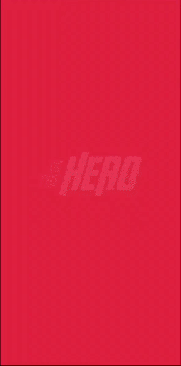

<h1 align="center">
  
</h1>

# Be The Hero
Projeto realizado na Semana OmniStack 11.0

  

  
	
  

  

  
<a aria-label="Completo">
    </img>
  </a>
  

<h2 align='center'>
      
</h2>      
<h2 align='center'>
      
	
</h2>

## :notebook: Instruções
  1. Para instalar as dependências necessárias, rode `npm` no terminal do back-end e do front-end.
  2. Para instalar as dependências necessárias do mobile, rode `yarn` no terminal.

## 🤝 Contribua
Contribuições, issues e pedidos de novas features são bem-vindos! Sinta-se livre para olhar a [página de issues](https://github.com/weltonfelix/omnistack11/issues).
- Faça um fork;
- Crie um branch com sua feature: `git checkout -b my-feature`;
- Faça um commit das mudanças: `git commit -m 'feat: My new feature'`;
- Faça um push para o seu branch: `git push origin my-feature`.
- Faça um pull request.

Após o seu pull request ser aprovado, você pode deletar o seu branch.

## :memo: Licença

This project is under the MIT license. See the [LICENSE](LICENSE.md) for details.

---

Made with ♥ by Welton Felix :wave:

